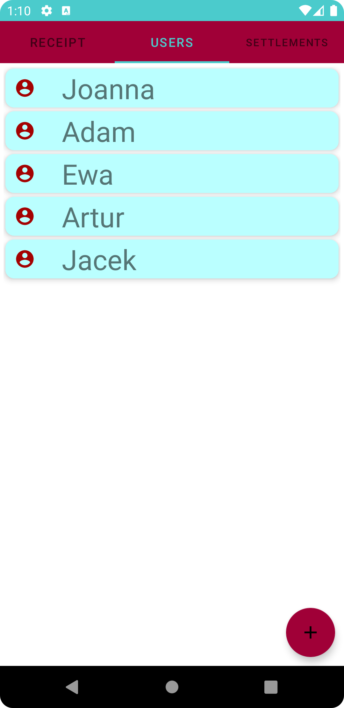
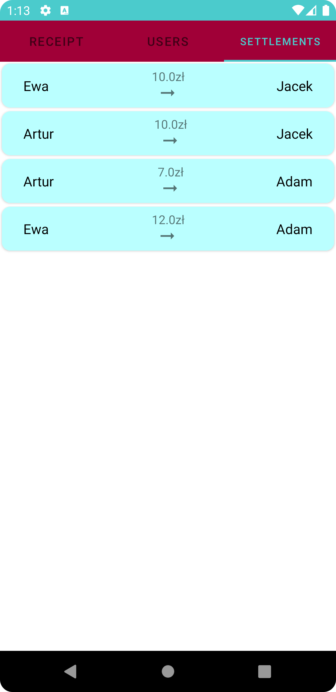
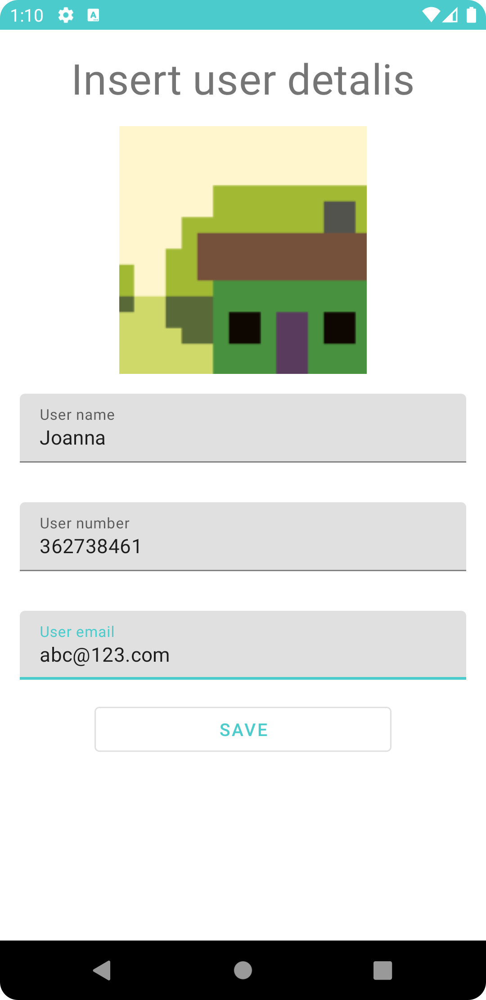
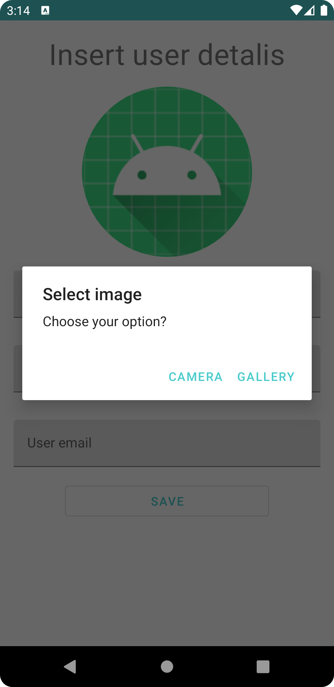

# Receipt Calculator
Sytuacje w codziennym życiu zainspirowały mnie do stworzenia aplikacji ułatwijącej prowadzenie rozliczeń.
Everyday situation were an inspiration to create an app which would help to run settlements.

## Table of Contents
* [General Info](#general-information)
* [Technologies Used](#technologies-used)
* [Features](#features)
* [Screenshots](#screenshots)
* [Setup](#setup)
* [Project Status](#project-status)
* [Room for Improvement](#room-for-improvement)
* [Contact](#contact)

## General Information

The application was created for a group of people who share expenses. In some cases sharing costs can be problematic, 
especially when they are not equal. Receipt Calculator allows to upload receipts and users, and calculate the expenses. 
The application avoids redundant transactions, and shows the results clearly.

## Technologies Used
- Material Design 1.3.0
- Kotlin 1.5.0
- ViewPager2 1.0.0
- Firebase Database 20.0.0
- ViewModel
- Navigation Graph

## Features
List the ready features here:
* users list
* user CRUD
* receipts list
* receipt CRUD
* adding items settled differntly
* settlement list
* displaing settlements
* uploading receipt picture
* user avatar

## Screenshots
Application screen overview
### Application main screens
From the left: receipts list, users list, settlement list

  
  
  

### Adding new receipt form
When adding a receipt, we complete who paid, how much and for whom. Items which are settled differently than 
the entire receipt can be picked up.

  
  

### Add user
Adding a new user, except for basic data, an avatar can be set- either by taking a picture with a camera or choosing from a photo gallery.

  
  

## Setup
1. Download the samples by cloning this repository
2. In the welcome screen of Android Studio, select "Open an Existing project"
3. Select one of the sample directories from this repository

Alternatively, use the `gradlew build` command to build the project directly

## Project Status
Project is: _in progress_

## Room for Improvement
To do:
* expenses categories
* displaying receipt detalis
* users avatars
* archiving receipts

To improve:
* adding receipt picture
* upgading user and receipt CRUD
* changing color theme 

## Contact
Created by [@HKonstanty](https://github.com/HKonstanty/HKonstanty) - feel free to contact me!