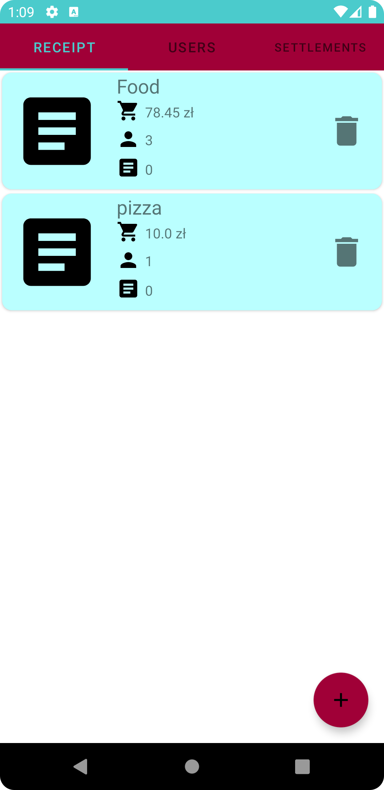
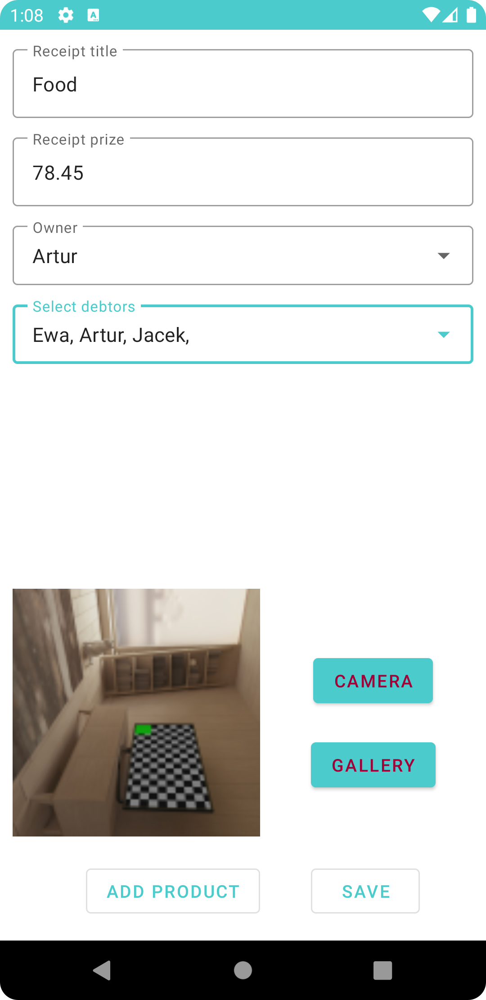
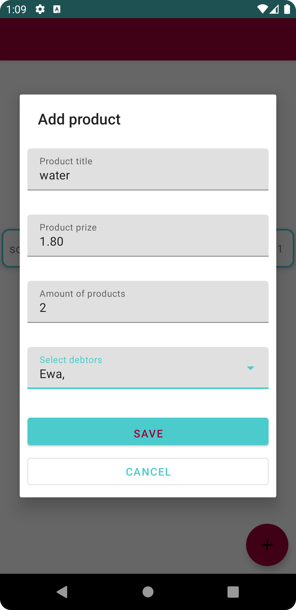

# Receipt Calculator
Sytuacje w codziennym życiu zainspirowały mnie do stworzenia aplikacji ułatwijącej prowadzenie rozliczeń.

## Table of Contents
* [General Info](#general-information)
* [Technologies Used](#technologies-used)
* [Features](#features)
* [Screenshots](#screenshots)
* [Setup](#setup)
* [Project Status](#project-status)
* [Room for Improvement](#room-for-improvement)
* [Contact](#contact)

## General Information
Apikacja przewidziana jest dla grupy ludzi, która dzieli się wydatkami między sobą. Zdarzają się sytuacje, kiedy rozliczenie większej liczby paragonów
bywa kłopotliwe zwłaszcza, gdy wydatki nie są dzielone po równo. Aplikacja _Receipt Calculator_ pozwala wprowadzać paragony oraz użytkowników,
na ich podstawie oblicza rozliczenia, tak aby uniknąć nadmiarowych transakcji i wświetla je w przejrzysty sposób. 

## Technologies Used
- Material Design 1.3.0
- Kotlin 1.5.0
- ViewPager2 1.0.0
- Firebase Database 20.0.0
- ViewModel
- Navigation Graph

## Features
List the ready features here:
* lista użytkowników
* CRUD użytkowników
* lista paragonów
* CRUD paragonów
* dodawanie produktów do paragonu rozlicanych inaczej
* lista rozliczeń
* wyświetlanie rozliczeń
* dodawanie zdjęcia paragonu
* awatar użytkownika

## Screenshots
Application screenshot review
### Lista paragonów

  
  
  

### Lista użytkowników

  
  
  

## Setup
1. Download the samples by cloning this repository
2. In the welcome screen of Android Studio, select "Open an Existing project"
3. Select one of the sample directories from this repository

Alternatively, use the `gradlew build` command to build the project directly

## Project Status
Project is: _in progress_

## Room for Improvement
To do:
* kategorie wydatków
* wgląd w szczegóły rozliczeń
* awatary użytkowników
* archiwizowanie paragonów

Do poprawy:
* dodawanie zdjęcia paragonu
* usprawnić operacje CRUD użytkowników i paragonów
* wygląd aplikacji/zmienić palete barw

## Contact
Created by [@HKonstanty](https://github.com/HKonstanty/HKonstanty) - feel free to contact me!